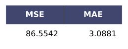
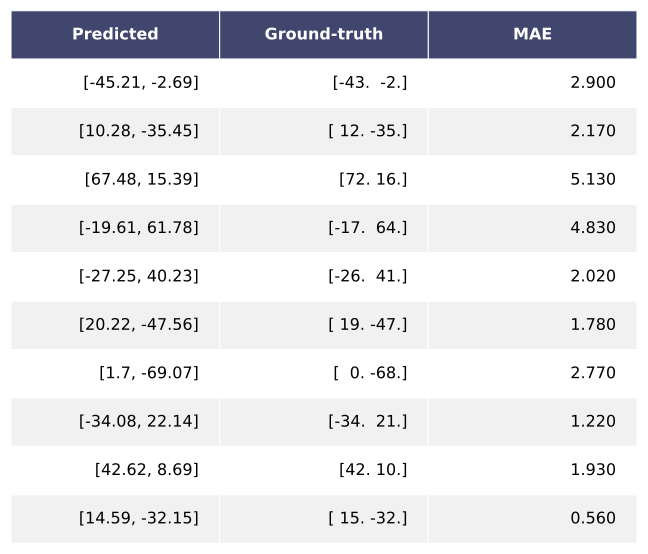
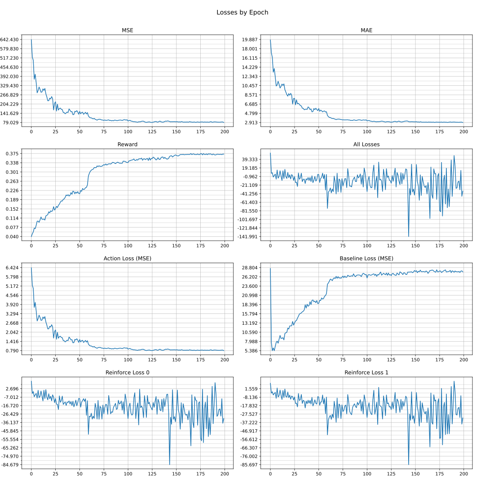
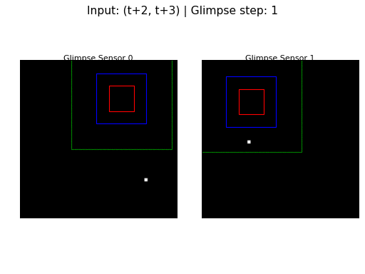
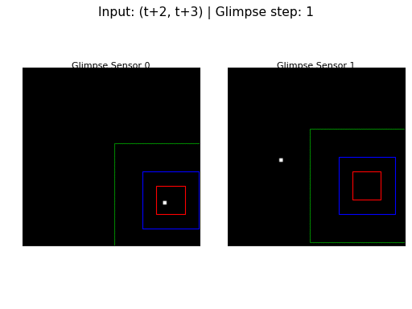

## R-RAM or RAM-VO

<h3>[*] Baseline Adjust Weigths (20/10)</h3>

<h5>Metrics on Test </h5>

<h5>Predictions on Test</h5>

<h5>Losses</h5>

<h5>Configuration</h5>

<h5>Glimpse Motion on Epoch 200</h5>

<h3>Baseline (19/10)</h3>

<h5>Metrics on Test</h5>

<h5>Predictions on Test</h5>

<h5>Losses</h5>

<h5>Configuration</h5>

<h5>Glimpse Motion on Epoch 200</h5>

