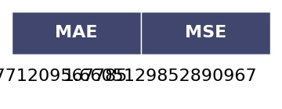
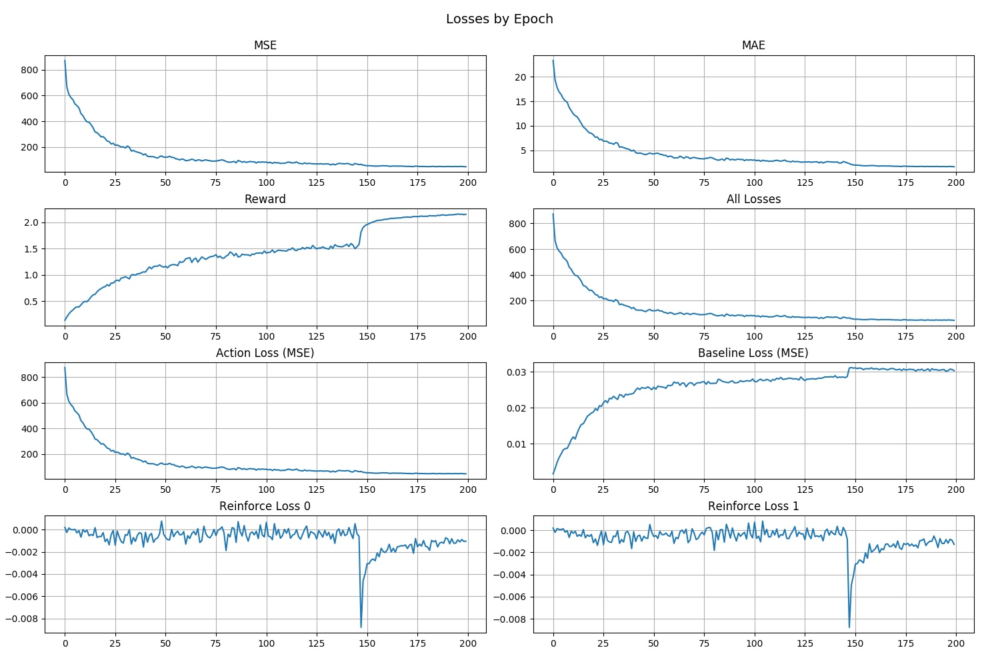
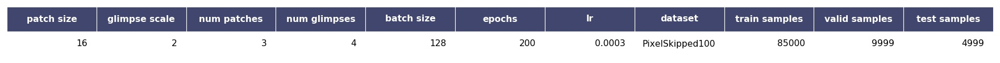
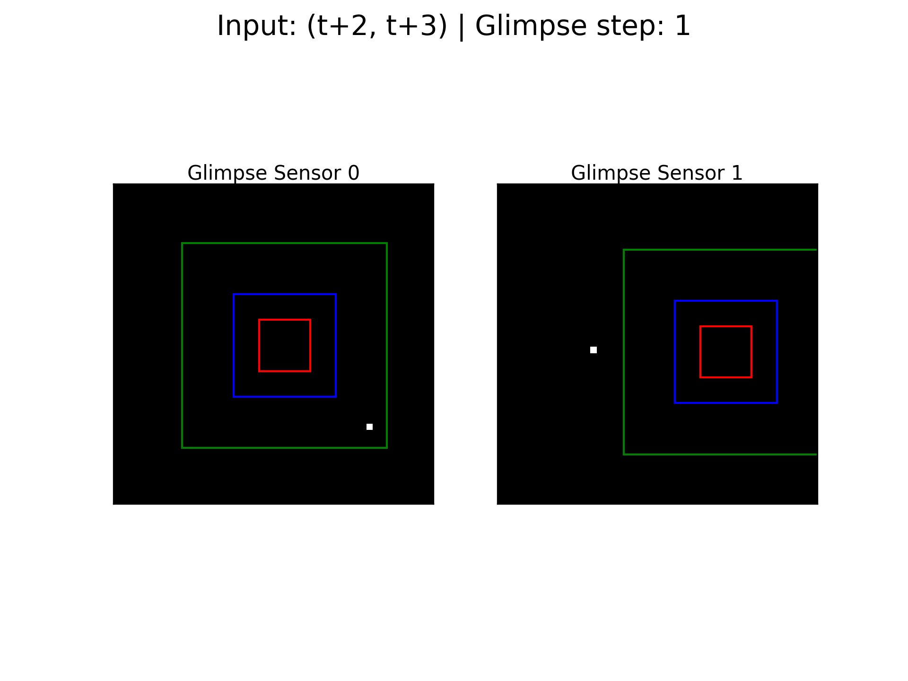

## R-RAM or RAM-VO

<h3>[*] Baseline Model</h3>

This is a baseline regression model built upon RAM. This model uses a black image pair with 100x100 pixels, the tracked point has 4x4 pixels. 

<h5>Results</h5>

<h5>Losses</h5>

<h5>Configuration</h5>

<h5>Glimpse Motion</h5>

