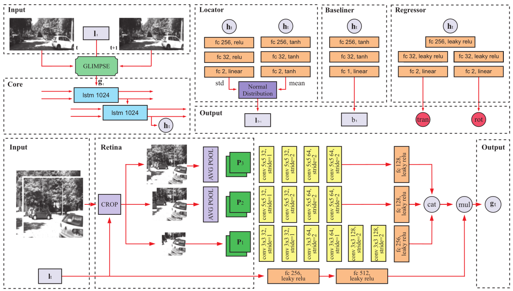

# RAM-VO: Less is more in Visual Odometry



Authors: Iury Cleveston, Esther L. Colombini

Paper: [RAM-VO: Less is more in Visual Odometry](https://arxiv.org/abs/2107.02974)

Thesis: [RAM-VO: A Recurrent Attentional Model for Visual Odometry](https://icleveston.com/docs/ramvo_thesis.pdf)

Train Demo: [Seq 00](https://www.youtube.com/watch?v=JjSA3lMqxBk), [Seq 02](https://www.youtube.com/watch?v=JjSA3lMqxBk), [Seq 04](https://www.youtube.com/watch?v=JjSA3lMqxBk), [Seq 05](https://www.youtube.com/watch?v=JjSA3lMqxBk), [Seq 06](https://www.youtube.com/watch?v=JjSA3lMqxBk), [Seq 08](https://www.youtube.com/watch?v=JjSA3lMqxBk)  

Test Demo: [Seq 03](https://www.youtube.com/watch?v=JjSA3lMqxBk), [Seq 07](https://www.youtube.com/watch?v=JjSA3lMqxBk), [Seq 10](https://www.youtube.com/watch?v=JjSA3lMqxBk)

Building vehicles capable of operating without human supervision requires the determination of the agent's pose.
Visual Odometry (VO) algorithms estimate the egomotion using only visual changes from the input images. 
The most recent VO methods implement deep-learning techniques using convolutional neural networks (CNN) extensively,
which add a substantial cost when dealing with high-resolution images. Furthermore, in VO tasks, more input data does
not mean a better prediction; on the contrary, the architecture may filter out useless information. 
Therefore, the implementation of computationally efficient and lightweight architectures is essential. 
In this work, we propose the RAM-VO, an extension of the Recurrent Attention Model (RAM) for visual odometry tasks.
RAM-VO improves the visual and temporal representation of information and implements the Proximal Policy Optimization (PPO)
to learn robust policies. The results indicate that RAM-VO can perform regressions with six degrees of freedom from monocular
input images using approximately 3 million parameters. In addition, experiments on the KITTI dataset demonstrate that 
RAM-VO achieves competitive results using only 5.7% of the available visual information.

The contributions of this work are:
- A lightweight VO method that selects the important input information via attentional mechanisms;
- The first visual odometry architecture that implements reinforcement learning in part of the pipeline;
- Several experiments on KITTI sequences demonstrating the validity and efficiency of RAM-VO.


## Instalation

RAM-VO requires Python 3.8. Cuda is not required, although recommended.

```bash
git clone
pip install -r requirements.txt
```

## Usage

To train a new model:
```python
python main.py
```

this command generates a folder `<out_exec_folder>` inside `out/` containing the model and data from training.

To test a trained model on a specific sequence:
```python
python main.py --test <out_exec_folder> --dataset 'kitti' --test_seq <sequence>
```

To generate results, such as metrics, trajectories, and plots:
```bash
./gen_results.zsh <out_exec_folder>
```

### Tools

There is no need to use these scripts directly, the `gen_results.zsh` already call them.

To generate the trajectories and metrics (RPE, ATE):
```python
python tools/gen_metrics.py --data_dir <out_exec_folder>
```

To plot the observations(glimpses):
```python
python tools/plot_glimpse.py --dir <out_exec_folder> --epoch test
```

To plot the loss:
```python
python tools/plot_loss.py --data_dir <out_exec_folder> --minibatch false
```

To plot the heatmap of observations:
```python
python tools/plot_heatmap.py --dir <out_exec_folder> --glimpse <glimpse_number> --train false
```

To plot different trajectory predictions in the same figure:
```python
python tools/plot_all_trajectories.py --data_dir <sequence>
```

To test the retina submodule:
```python
python tools/test_retina.py
```

To extract the optical flow:
```python
python tools/extract_optical_flow.py --seq <sequence> --method <method:(sparse|dense)>
```

## Citation
If you use this code and data in your research, please cite our arxiv paper:
```
@article{cleveston2021ram,
  title={RAM-VO: Less is more in Visual Odometry},
  author={Cleveston, Iury and Colombini, Esther L},
  journal={arXiv preprint arXiv:2107.02974},
  year={2021}
}
```


